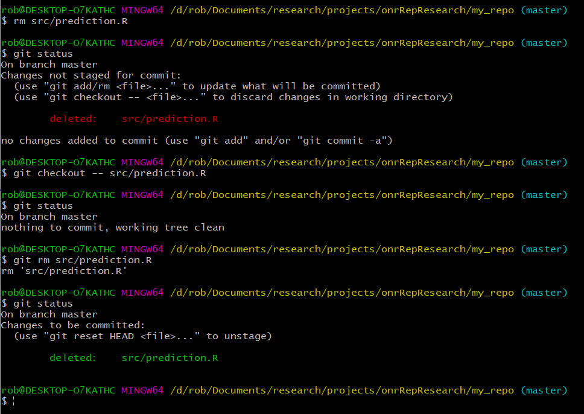

## Git Log
Now that we've made a few commits, we can start to look at how our project is evolving. Git log is a good way to do this; we've seen this before, but now we'll see a bit more


```bash
git log
```

This is a very flexible command, however, and there are a few ways we can clean it up to make the output a bit tidier:


```bash
git log --oneline --decorate --graph
```


So what all have we asked for? We've said, show us the log, but in a compact form, decorate it to have it show where the current branch (master) is pointing (HEAD), and show us the graph. Recall that git is a directed graph, where snapshots (commits) are the nodes. On the graph above we have 4 nodes, with the master branch pointing to the latest commit. We can move this pointer, but that's a topic we'll take up later.


## File Management with Git - rm and mv
One thing that is good to remember is that you've added a file to git, then it's being tracked until you delete it. And actually even if you delete it, it gets stored in previous commits - because it _was_ in that repo at one point in time. Though the file is just a file, once it's tracked, don't be tempted to remove it via the operating system. 

If you want to delete a file, or if you want to change it's name, git offers utlities to do this. Not surprisingly, they are ```git rm``` and ```git mv```. Let's see them in operation. First we'll add two files - one to move/rename and one to delete. We'll add these files tothe ```src``` directory.


```bash
touch src/prediction.R
touch src/simData.R
git add .
git commit -m "Add Two Files for Experimenting with Moving and Deleting"
```

With these setup and added, let's delete it at the command line just to see what happens:


```bash
rm src/prediction.R
```

All looks good right from the OS point of view - right? What happens when you ask ```git``` what the status is?


```bash
git status
```


What to do now? Well we have options. One thing we could do is to add the deleted file with ```git add```, which is kind of confusing. 

Or we could back out the change, and do the deletions using ```git```. We do that with the git checkout command. (**n.b.** again - look at the help from git status - it tells you a lot.)


```bash
git checkout -- src/prediction.R
git status

```

Now we're back to a clean working directory. 

Instead of removing the file with ```rm```, let's use ```git``` to do this. Note that when you use ```git``` to do this, you'll see the status looks very different. Using ```rm``` makes a change (the deletion) that hasn't been staged, where as the second (```git rm```) makes a change that is staged and ready to be committed:



Basically to get a clean working directory if you go the ```rm``` route, you have to **add** the file to the staging area, only to then commit it. ```git rm``` just does that for you in one step. 

Now that that is clear, it is a good time to commit the deletion.


```bash
git commit -m "Delete prediction.R File"
```


With that file gone and the repo in a clean state, let's rename the other file - this time using ```git```. As above, if you use git's utilities for this, you don't have to add the changes. So instead of ```mv``` we'll use ```git mv```:


```bash
git mv src/simData.R src/simXYData.R
git commit -m "Rename Simulation Script for Clarity"
```


## Time for a Break
Before we move on to replicating this in RStudio, it's probably time for a break.


