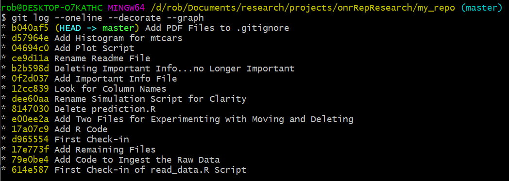
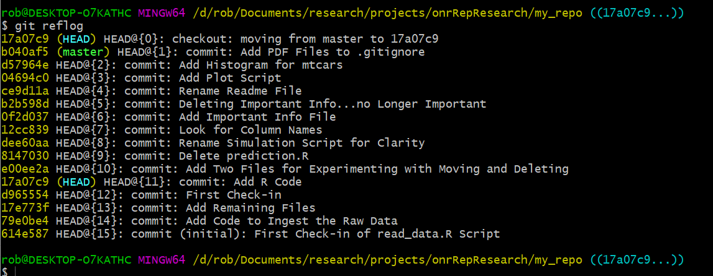

# Lesson 3 - Git in RStudio & Time Travel


The learning objectives here are 1) to work through the code/add/commit cycle in RStudio, and 2) to get a feel for how you can move around the repository. This is pretty mind-bendy to me at times, but if you go back to the core idea of git storing a series of snapshots as nodes along a graph, you'll be able to wrap your head around the idea of revisiting any of those nodes at any time.

## RStudio
RStudio provides a very nice front-end IDE for R. As it continues to develop, more and more capabilities are added. Version control with ```svn``` or ```git``` has been available for quite some time. You may have even seen the git tab in RStudio and wondered what it was doing there. I use both the command line and RStudio for my git work, so it's a good idea to have a feel for both. I prefer the command line interface for some things, but being a visual person, RStudio's git support has a lot to offer. IN particular, it's quite easy to write a good commit message, and to visually see the diffs/changes that you are making.

You will have seen how we did this in the Lecture - now it's your turn. Make some changes to a file, add and commit them. Also, add a new script, and note the difference in the buttons in the git tab in RStudio - i.e. when do you see an A in the button vs. an M? What are the command line analogs?

## Git Diff
How can we easily see what changed between two commits? We may see that one line indicated a big change that we want to inspect. Use the diff command on any two nodes in the graph:


```bash
git diff 9efbc59 48f84c5
```

Note that the order matters. The code above says show me what changed as the repo moved from ```9efbc59``` to ```48f84c5``` Here's what mine looked like:


When you think about working with your future self - let alone any additional collaborators - these diffs are powerful ways to see what actually changed. Couple the diffs with a good commit message, and you can quickly get oriented into how and why things change over time. 

Compare this to a script that you just rename, or keep saving as you alter it. You may get to a point with that script, where it's broken and it's hard to go back to its state when it last worked. Or you may recall having ventured down a pathway that you gave up on, only _now_ you want to get back to that path to try that experiment again. With ```git``` this is straightforward. Without ```git``` it's just about impossible.

One thing you can get in the habit of doing (if it works for you) is to look at the diffs before you commit. My typical workflow is something like:

1. write some code
2. Add it
3. Commit it
4. write some more code, etc.

Before you add and commit the changes, though, you can just type ```git diff``` to see what has been changed. With the code we've been running here, it's just toy syntax, but if you were working on a complicated function, it's often nice to see what you've done. 

## Going to a Particular Snapshot
Now that we have a few commits built up, we can go back to a particular commit and have our code (in the same file!) look exactly as it did at that commit. And we can do this without throwing away the most recent work. Take a look at your history with ```git log --oneline``` and chose a commit you want to navigate to. 



Yours will be different from mine, but to go to that node, we use the ```checkout``` command:


```bash
git checkout 0a215c7
```

You'll see the detached HEAD warning, and if you type ```git ls-files``` you'll see the files git was tracking at that point in time. If you look at the plot script, you'll see it at that state:


In my case the plot script. 

Two thoughts here:

1. If we wanted to recreate old figures. This is one way we could do it. Checkout an old repo, and re-issue the R code from the command line to make the file. You can also hang on to them as we mentioned in lecture via the storing of old copies of the ```results/Figures``` folder with an archival date. Just make sure you are consistent if you follow this, otherwise you may end up with an old file that has a current name, but not the current content, etc.

2. Type ```git log --oneline --decorate``` here to see what you get. You'll probably see a shortened history, because we've moved the pointer back to this particular commit, and commits know their parent commit - so the later ones aren't listed. This may give you great pause because you don't see work you've already done. There's yet another command to help you.


```bash
git reflog
```


This command basically stores every command you issue in git. So you can see that now we're checked out on the 0a215c7 node, and even though we don't see all the other downstream commits when we type ```git log``` we can rest assured that they commits are all still there.

This can be really useful as you progress and get into more complicated things with merging branches and rebasing the repository. The take home is that git tries really really hard not to lose your data.

To get back to the last commit:


```bash
git checkout master
```


